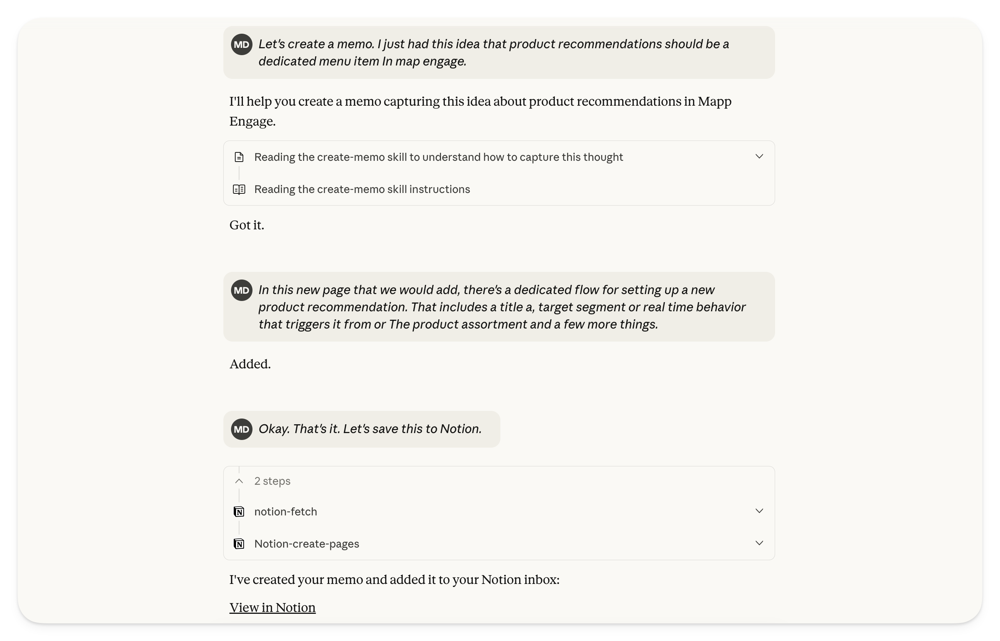

# Claude Memo Capture Skill

A Claude skill that records typed or dictated thoughts as raw memo content and converts them into polished, structured documents ready for Notion. Designed for product builders who need a reliable “thought-to-note” pipeline without manual transcription.

## Configuration

- Review the SKILL.md file and modify it as needed
- Add the Notion database ID to the SKILL.md file if you want to make use of storing the memo in Notion (this will make the MCP tool use faster)
- Upload the skill to Claude (for web and app use)

For full context and usage walkthrough, see my "The AI-enabled Product Builder" resource: [From Thought To Note](https://productized.tech/the-ai-enabled-product-builder/from-thought-to-note)